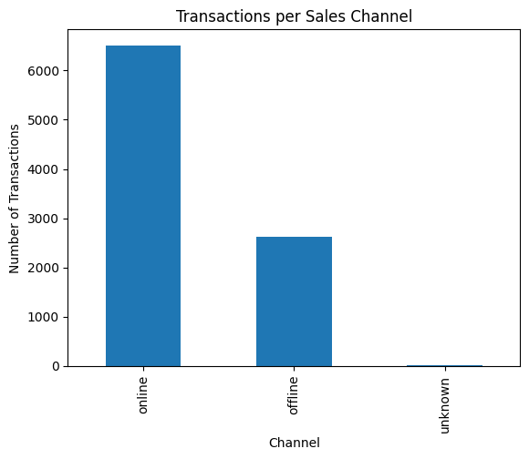
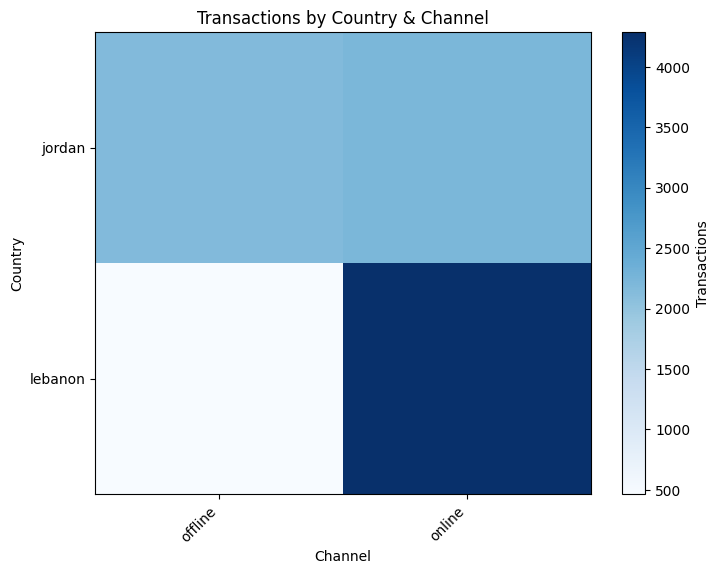
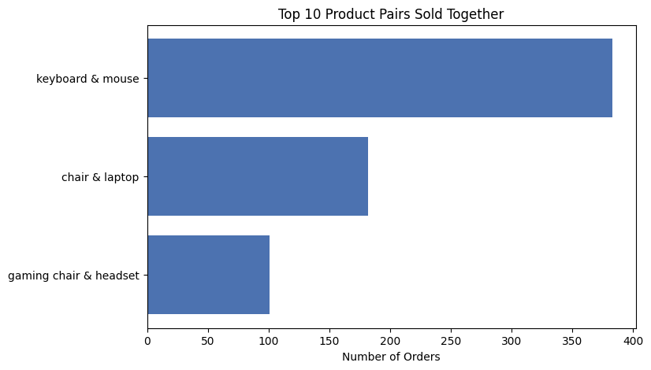
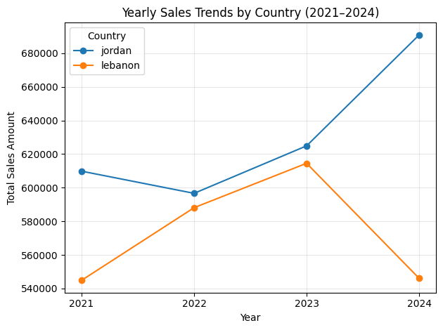

# E-Commerce Sales Analysis

[](https://www.python.org/)
[](https://jupyter.org/)
[](https://pandas.pydata.org/)
[](https://matplotlib.org/)

An exploratory analysis of multichannel electronics sales across **Jordan and Lebanon**. The notebook combines two sales files with customer data, cleans inconsistent records, engineers business-ready features, and answers practical questions about channels, products, customers, revenue, and sales trends.

## Project snapshot

| Metric | Value |
|---|---:|
| Raw sales rows | 9,162 |
| Rows after duplicate removal | 9,147 |
| Unique orders | 8,481 |
| Customers represented in sales | 1,000 |
| Customer records | 1,378 |
| Products | 11 |
| Analysis period | January 2021 – July 2025 |

## What the analysis covers

- Data-quality checks for missing values, inconsistent labels, and duplicates
- Standardization of channel and country values
- Project-specific conversion of prices to a common USD field
- Revenue and time-feature engineering
- Sales-channel and product performance
- Customer-sector and city-level analysis
- Product-pair analysis for cross-selling opportunities
- Weekday, monthly, and yearly sales trends
- Salesperson performance and year-over-year growth

## Selected findings

- **Online was the dominant sales channel**, with 6,513 transaction rows compared with 2,629 offline and 5 with an unknown channel.
- **Tuesday generated the highest 2024 sales amount**, reaching approximately 236,342 in the notebook's standardized monetary values.
- **Lebanon's offline channel had the fewest transactions** among valid country-channel combinations, with 466.
- **Keyboard and mouse was the most frequent product pair**, appearing together in 383 orders.
- **University was the largest sector among the analyzed loyal-customer segment**, with 22 records.
- **Irbid led Jordan's online sales volume by city**, with 3,915 units.
- Jordan's year-over-year sales increased by **10.56% in 2024**, while Lebanon declined by **11.13%** in the same year.

## Visual highlights

### Channel activity



### Country and channel comparison



### Products frequently purchased together



### Yearly country trends



## Repository contents

```text
.
├── Ecommerce-sales-analysis.ipynb   # Complete cleaning and analysis workflow
├── customers.csv                    # Customer channel, city, and sector data
├── sales_data_part1.csv             # First sales-data partition
├── sales_data_part2.csv             # Second sales-data partition
├── images/                           # Charts displayed in this README
├── requirements.txt                 # Python dependencies
└── README.md
```

## Run the notebook

```bash
git clone https://github.com/YazeedAlzoubi05/Ecommerce-sales-analysis.git
cd Ecommerce-sales-analysis
python -m venv .venv
```

Activate the environment:

```bash
# Windows
.venv\Scripts\activate

# macOS/Linux
source .venv/bin/activate
```

Install the dependencies and start Jupyter:

```bash
pip install -r requirements.txt
jupyter notebook Ecommerce-sales-analysis.ipynb
```

The three CSV files must remain in the repository root because the notebook loads them using relative paths.

## Data preparation

The notebook:

1. Loads and concatenates both sales partitions.
2. Normalizes column names and selected text fields.
3. Maps equivalent channel labels to `online` or `offline` and retains missing channels as `unknown`.
4. Removes fully duplicated rows.
5. Standardizes country-code variations for Jordan and Lebanon.
6. Creates USD price and transaction-value fields using the project's conversion rules.
7. Extracts year, month, and weekday features for trend analysis.
8. Joins sales and customer data where customer attributes are required.

## Assumptions and limitations

- Zero-unit transaction rows are treated as data errors and changed to one unit in the notebook.
- Currency normalization follows the conversion rules defined in the notebook; financial conclusions depend on those assumptions.
- The 2025 data ends on July 10, so 2025 is not treated as a complete year in year-over-year comparisons.
- The findings are descriptive and should not be interpreted as causal effects.

## Author

**Yazeed Alzoubi**

[GitHub profile](https://github.com/YazeedAlzoubi05)
